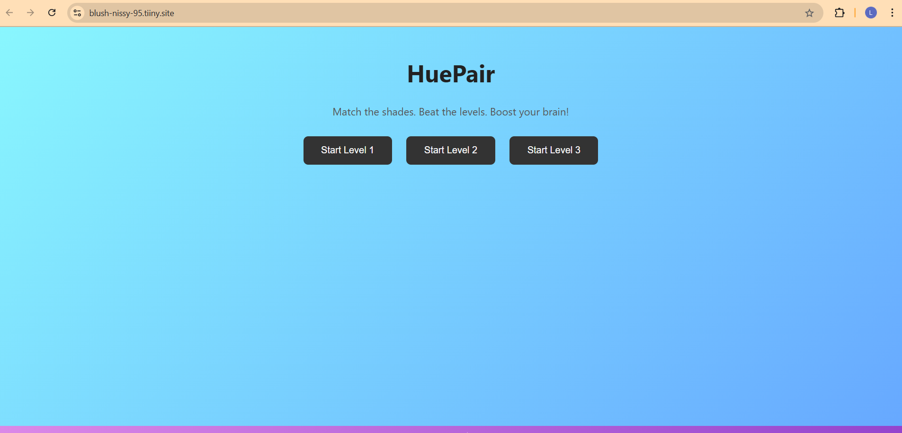
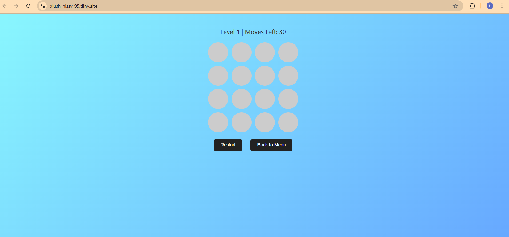
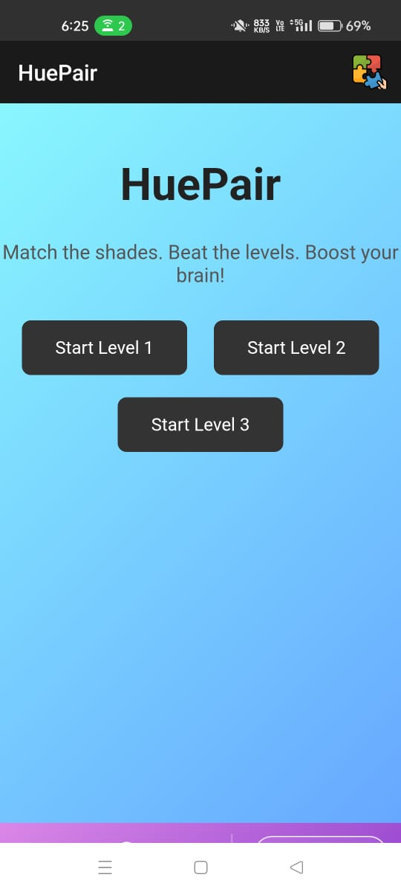
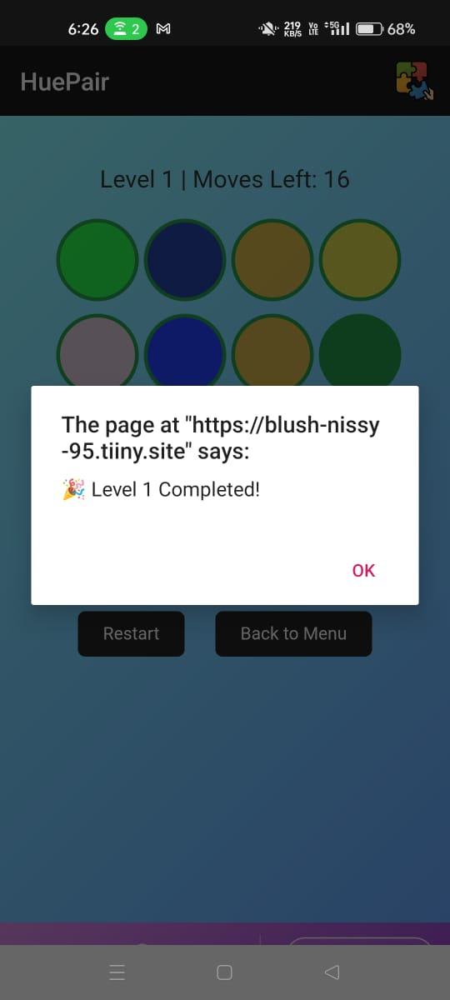

# HuePair - Color Match Game

## Description

**HuePair** is a fun and interactive memory matching game where users match colored circles. The game starts with a grid of colored circles, and users must pair matching colors within a set number of moves. The game becomes progressively harder with each level.

- **Level 1**: 4x4 grid, 30 moves
- **Level 2**: 5x5 grid, 40 moves
- **Level 3**: 6x6 grid, 50 moves

## Features

- Multiple levels with different grid sizes and move limits.
- Intuitive gameplay with color matching.
- Responsive design, optimized for both desktop and mobile.

## Technologies Used

- **HTML**: For creating the structure of the game.
- **CSS**: For styling and making the game visually appealing.
- **JavaScript**: For handling the game logic and interactions.

## How to Play

1. Select two circles at a time.
2. If they match, they stay revealed.
3. If they don't match, they turn back to their original state.
4. Complete each level by matching all the circles within the allowed number of moves.

## Screenshots

### Website View (Home Page)

This is the **home page** of the **HuePair** game hosted on a public website.

### Game Page (Game View)

This is the **game page** where players can play the memory matching game.

### Mobile View (Home Page)

This is the **mobile view** of the **HuePair** game on a smartphone, showing the **home page** layout.

### Mobile View (Game Page)

This is the **mobile view** of the **game page**, showing the memory matching game on a smartphone.

## How to Access the Game Online

The **HuePair** game is hosted on **Tiny.Host**, making it available as a public website. You can play the game directly in your web browser by visiting:

[Play HuePair Game Online](https://blush-nissy-95.tiiny.site/)

## Converting to Mobile App (APK)

### Steps to Convert Website to Mobile App using WebToApp:

1. **Prepare Your Web Game**: I created the HuePair game using HTML, CSS, and JavaScript. The game is responsive and works well on both mobile and desktop.
   
2. **Convert Website to Mobile App**: 
   - To turn the website into an Android app, I used a service called **WebToApp**.
   - **WebToApp** allows you to convert a website into a mobile application by simply entering the URL. It wraps the website into an Android app format (APK).
   - I submitted the URL of the game hosted on **Tiny.Host** to **WebToApp**, which then created an APK file.

3. **Download the APK**: After the conversion process, you will receive the APK file. You can install this APK file on your Android device to play the game as a mobile app.

### Steps to Install APK on Android:

1. Download the APK file.
   - [Download HuePair APK](https://drive.google.com/file/d/1Xi01mR7BY5AbQOyzUmSVDgWtE2b_u2_0/view?usp=sharing)

2. Enable **Unknown Sources** installation on your Android device:
   - Go to **Settings** > **Security** > Enable **Install from Unknown Sources**.

3. Install the APK:
   - Open the downloaded APK file and follow the prompts to install the game.

4. Once installed, you can open the app directly on your Android device and start playing.

## Future Plans

- Add more levels and game modes.
- Include a scoring system to track performance.

